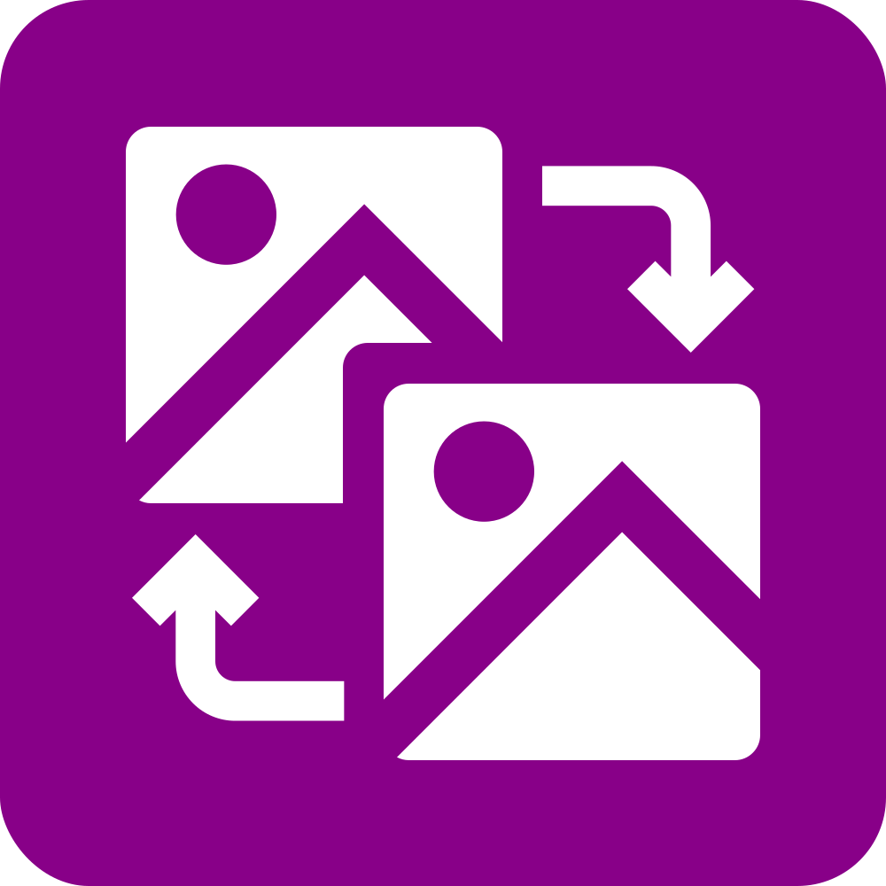

# Alfred Workflows Collection

A collection of productivity-focused Alfred workflows for macOS developers and power users.

## Workflows

###  [Augment Code Tasks](./alfred-augment/)

Productivity tools for development workflow management, including task entry creation and process management.

**Key Features:**

- Create formatted task entries with the `au` command
- Kill processes running on specific ports with `killport`
- Compatible with Augment Code agent task management system

[→ View detailed documentation](./alfred-augment/README.md)

###  [ImageOptim-ize](./imageoptim-ize/)

Streamline image optimization directly from Finder using ImageOptim.

**Key Features:**

- Batch optimize selected images with a hotkey (default: ctrl+shift+cmd+I)
- Automatic metadata removal and file size reduction
- Progress notifications during optimization

[→ View detailed documentation](./imageoptim-ize/README.md)

###  [Port Roulette](./port-roulette/)

Generate unique port numbers for development projects with intelligent conflict avoidance.

**Key Features:**

- Smart port generation based on project names
- Avoids well-known ports and conflicts
- Persistent memory of assigned ports
- Automatic clipboard copying

[→ View detailed documentation](./port-roulette/README.md)

###  [Image Convert](./image-convert/)

Convert images between PNG and JPEG formats directly from Finder with intelligent format detection.

**Key Features:**

- Smart format detection for PNG and JPEG files
- Bidirectional conversion with high quality output
- Batch processing of multiple files
- Preserves transparency in PNG conversions

[→ View detailed documentation](./image-convert/README.md)

###  [Sanitize Filenames](./sanitize-filenames/)

Clean up filenames for web use by converting them to kebab-case and removing special characters.

**Key Features:**

- Converts filenames to lowercase
- Removes special characters and replaces with web-safe alternatives
- Converts spaces and underscores to dashes
- Batch processing of selected files

[→ View detailed documentation](./sanitize-filenames/README.md)

## Installation

Each workflow can be installed independently:

1. Navigate to the desired workflow directory
2. Double-click the `.alfredworkflow` file
3. Alfred will prompt you to install the workflow
4. Click "Import" to add it to your Alfred workflows

## Requirements

- **Alfred 4+** with Powerpack license
- **macOS** (Alfred is macOS-only)
- **Python 3.x** (required for Port Roulette)
- **ImageOptim** (required for ImageOptim-ize workflow)

## Contributing

Issues and pull requests are welcome! Each workflow is self-contained in its respective directory.

## License

Individual workflows may have their own licenses. Please check each workflow's directory for specific licensing information.

---

**Author:** [ziad@feralcreative.co](mailto:ziad@feralcreative.co)
